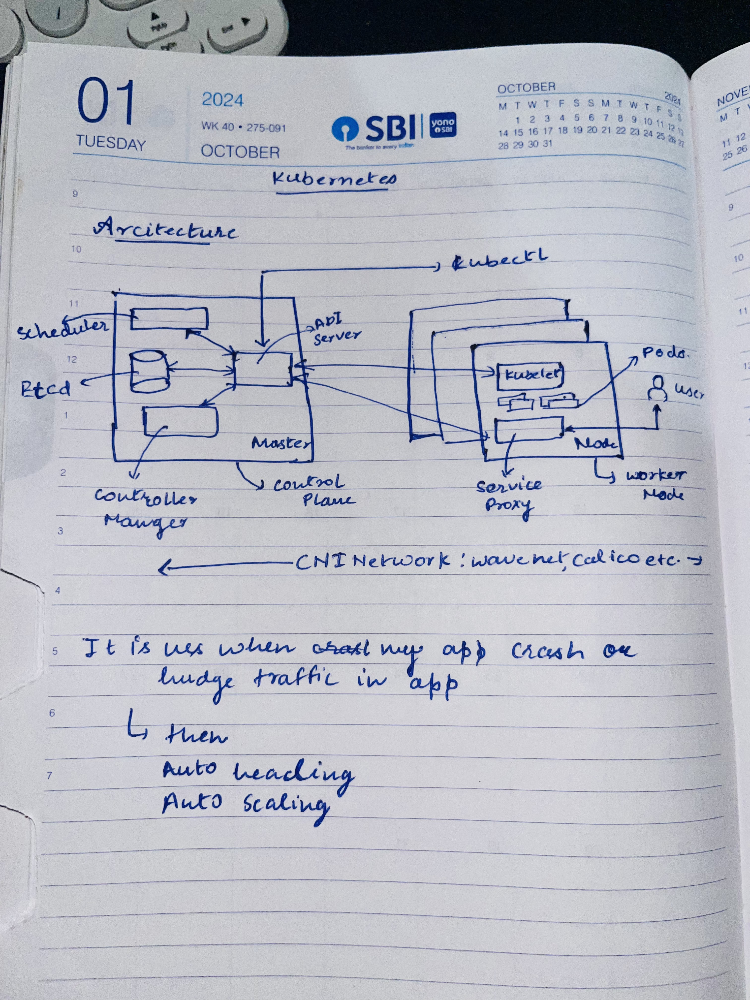
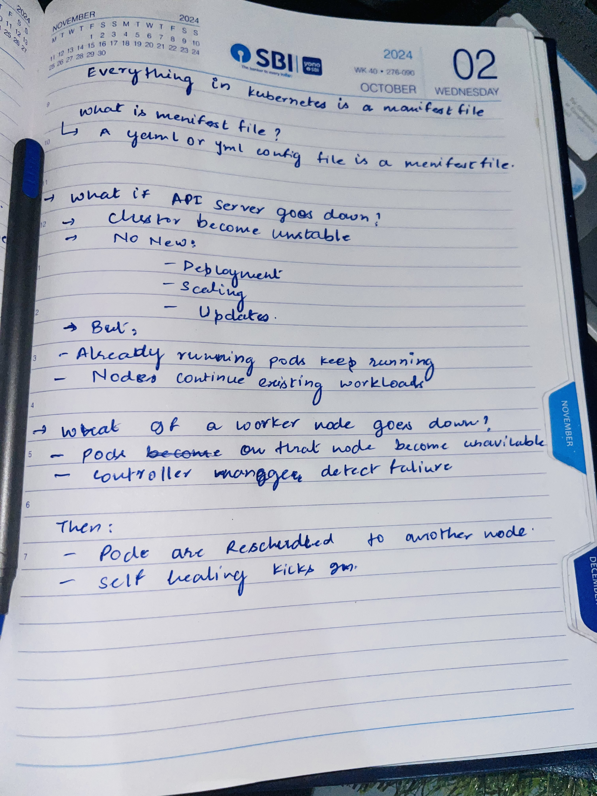

# Task 1: Recall the Kubernetes Story

## Why was Kubernetes created?

Docker made it easy to create and run containers, but it had limitations:

- No native way to manage containers at scale
- No automatic scaling
- No self-healing (restart failed containers)
- No built-in load balancing
- Difficult to manage across multiple machines

👉 **Conclusion:**
- Docker = Container runtime
- Kubernetes = Container orchestration platform

Kubernetes was created to **manage, scale, and automate containerized applications in production environments**.

---

## 🧑‍💻 Who created Kubernetes? What was it inspired by?

- Created by **Google**
- Later donated to **Cloud Native Computing Foundation (CNCF)**

### 🔍 Inspired by:
- Google’s internal system: **Borg**

Borg was used internally by Google to manage large-scale applications like Gmail, YouTube, etc.

---

## 📛 What does "Kubernetes" mean?

- Origin: **Greek**
- Meaning: **"Helmsman" or "Ship Pilot"**

### 🚢 Fun Facts:
- Kubernetes logo = Ship wheel ⚓
- Short form: **K8s**
  - (8 letters between K and S)

---

## 🔁 Quick Summary

- Problem solved: **Container orchestration at scale**
- Created by: **Google**
- Inspired by: **Borg**
- Meaning: **Helmsman (controller of systems/containers)**

---

## 🧾 Notes

Kubernetes helps in:
- Deployment automation
- Scaling applications
- Managing failures
- Running containers across clusters

It is the backbone of modern **cloud-native applications**.

# Task 2: Draw the Kubernetes Architecture

## Kubernetes Architecture

