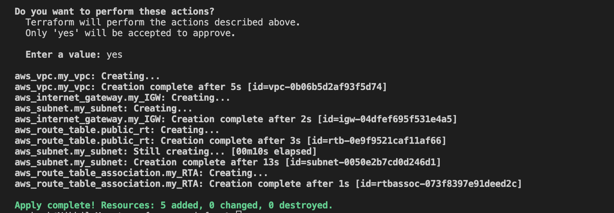
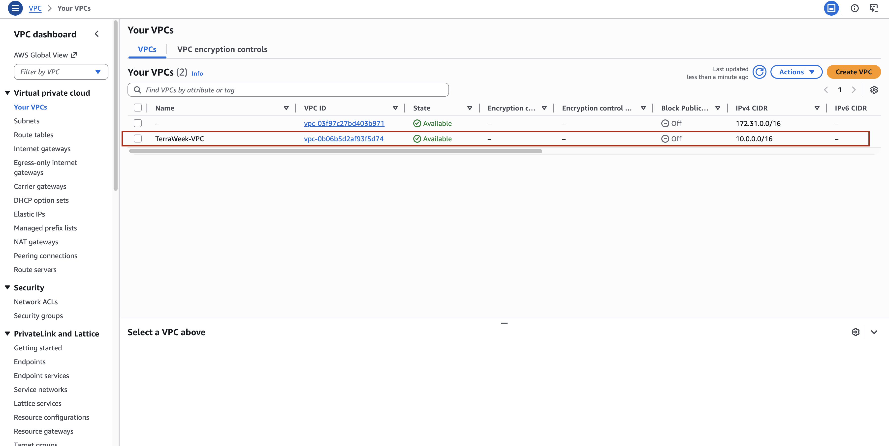
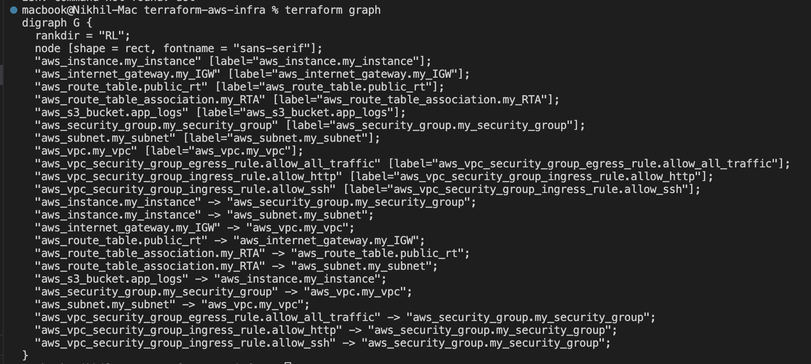

# Day 62 -- Providers & Resources

## 📦 Full main.tf with Explanation

``` hcl
terraform {
  required_providers {
    aws = {
      source  = "hashicorp/aws"
      version = "5.0"
    }
  }
 
}

provider "aws" {

	region="us-east-1"

}


#VPC
resource "aws_vpc" "my_vpc" {
  cidr_block       = "10.0.0.0/16"

  tags = {
    Name = "TerraWeek-VPC"
  }
}


#Public Subnet
resource "aws_subnet" "my_subnet" {
  vpc_id     = aws_vpc.my_vpc.id
  cidr_block = "10.0.1.0/24"
  map_public_ip_on_launch = true


  tags = {
    Name = "TerraWeek-Public-Subnet"
  }
}

#Internet Gatway
resource "aws_internet_gateway" "my_IGW" {
  vpc_id = aws_vpc.my_vpc.id

  tags = {
    Name = "Terraform IGW" # IGW means Internet Gateway
  }
}

#Route Table
resource "aws_route_table" "public_rt" {
  vpc_id = aws_vpc.my_vpc.id

  route {
    cidr_block = "0.0.0.0/0"
    gateway_id = aws_internet_gateway.my_IGW.id
  }

  tags = {
    Name = "TerraWeek-Public-RT"
  }
}

# Route Table Associate

resource "aws_route_table_association" "my_RTA" {
  subnet_id      = aws_subnet.my_subnet.id
  route_table_id = aws_route_table.public_rt.id
}


#Added Security Group

resource aws_security_group my_security_group {

name="TerraWeek-SG"
vpc_id= aws_vpc.my_vpc.id  # interpolation
description = "this is Inbound and outbound rules for your instance Security group"

}

# Inbound & Outbount port rules


resource aws_vpc_security_group_ingress_rule allow_http {
  security_group_id = aws_security_group.my_security_group.id
  cidr_ipv4         = "0.0.0.0/0"
  from_port         = 80
  ip_protocol       = "tcp"
  to_port           = 80
}

resource aws_vpc_security_group_ingress_rule allow_ssh {
  security_group_id = aws_security_group.my_security_group.id
  cidr_ipv4         = "0.0.0.0/0"
  from_port         = 22
  ip_protocol       = "tcp"
  to_port           = 22
}


resource aws_vpc_security_group_egress_rule allow_all_traffic {
  security_group_id = aws_security_group.my_security_group.id
  cidr_ipv4         = "0.0.0.0/0"
  ip_protocol       = "-1" # semantically equivalent to all ports
}


# EC2 INSTANCE

resource aws_instance my_instance {

	ami = "ami-0ec10929233384c7f" # OS AMI ID

	instance_type = "t3.micro" # Instance Type

    subnet_id = aws_subnet.my_subnet.id

	vpc_security_group_ids = [aws_security_group.my_security_group.id] # VPC & Security Group
	
	associate_public_ip_address = true

      lifecycle {
  create_before_destroy = true
}

	tags = {
    Name = "TerraWeek-Server"
  }

}

#s3 Bucket


resource "aws_s3_bucket" "app_logs" {
  bucket = "terraweek-app-logs-12345" # must be globally unique

  depends_on = [aws_instance.my_instance]

  tags = {
    Name = "TerraWeek-Logs"
  }
}
```

------------------------------------------------------------------------

## 📸 Screenshots

### Terraform Apply Output



### AWS Console VPC Resources



------------------------------------------------------------------------

## 🌳 Dependency Graph

    aws_vpc
     ├── aws_subnet
     │     └── aws_instance
     │            └── aws_s3_bucket
     ├── aws_internet_gateway
     └── aws_route_table
            └── aws_route_table_association


------------------------------------------------------------------------

## 🧠 Implicit vs Explicit Dependencies

### Implicit Dependencies

Terraform automatically understands dependencies when one resource
references another.

Example: - Subnet depends on VPC using `vpc_id` - Instance depends on
subnet

### Explicit Dependencies

When Terraform cannot detect dependency, we manually define it using
`depends_on`.

Example: - S3 bucket depends on EC2 even without direct reference

------------------------------------------------------------------------

## 🚀 Summary

-   Terraform builds dependency graph automatically
-   Implicit dependencies come from references
-   Explicit dependencies are manually defined
-   Lifecycle rules control creation & destruction behavior
